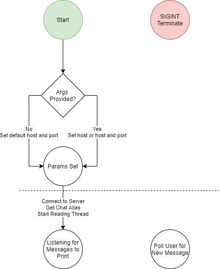

# About
This application implements a chat client that really is no more complex than an echo client. Each client will have the ability to send text strings to the server and will also be able to see the text sent by all other clients. The application is run through console. The select call has been used to implement multiplexed I/O.

How to compile and run

Client: g++ -Wall -o client client.cpp -lpthread, followed by ./client <hostname>, localhost can be used for hostname to run

Server: g++ -Wall -o server server.cpp, followed by ./server to run

# Design
## Server State Diagram

## Client State Diagram

## Pseudocode

### Server.cpp – Mian
Get user args

Crete Socket

Add socket to the set of file descriptors

Listen for activity on the set – if anything happens, check if it’s a new connection request, if so create a socket and add it to the set, if not process the activity as a message

Parse the message and add the IP address for re-transmission

Send the message to everyone who is not either the listening socket or the sender

### Client.cpp
Get user args

Crete Socket

Connect to the host/port

Get the user’s chat alias

Create a thread for listening to messages from the server

Poll for messages from the user and append their alias to each message

# Testing
A pcap was provided in this submission of the TCP traffic for demonstration purposes in addition to the below tests.

## All users can see each other’s IP addresses
Condition: Each message received should have the sender’s IP address prepended to it.

Result: Passed

## A user does not receive a message from the server from themself
Condition: I should not see an IP prepended to my own messages (the server prepends an IP to all messages it relays)

Result: Passed

## All users can see their chat names on each message
Condition: Each user should, in addition to seeing IP addresses, be able to read an alias for the sender

Result: Passed
